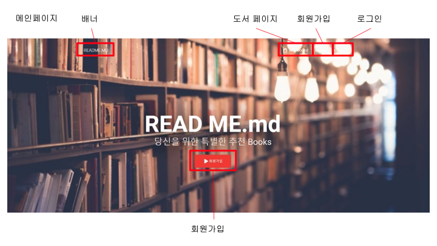
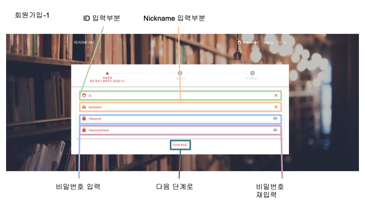
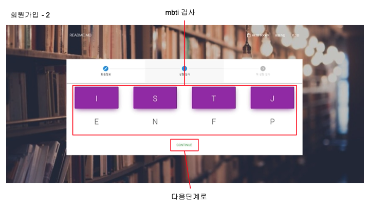

# README

- 해당 프로젝트는 기한 내에 완성하지 못한 프로젝트입니다.


컨텐츠 기반 추천 시스템( Content-based Recommendation )을 사용한 추천시스템을 사용하여 도서 추천을 하도록 기획한 서비스 입니다.


## 개발 환경

### Tech Stack

| Category           | Name                      |
| ------------------ | ------------------------- |
| Language           | JAVA / PYTHON / html /css |
| Front-end          | Vue.js / VUEX / Node      |
| Back-end           | Spring Boot, Gradle       |
| Database           | MYSQL / JPA               |
| Develop tool       | VS Code / Eclipse         |
| Collaboration tool | Git / JIRA                |
| DevOps             | Nginx                     |
| ETC                | selenium                  |


### ETC

- **Library**
  - __Pandas__
    - __링크__ : https://pandas.pydata.org/
    - __소개__ : 데이터 조작 및 분석을 위한 라이브러리
    - __사용 기능__ : 숫자 테이블 조작

  - __Selenium__
    - __링크__ : https://www.selenium.dev/
    - __소개__ : 데이터 수집을 위한 라이브러리
    - __사용 기능__ : 데이터 크롤링


## 프로젝트 설치 안내

- 로컬에서의 프론트엔드 실행 시 명령어
  ```bash
  # front-end directory
  cd ./frontend
  
  # requirements setting
  yarn install
  # run
  yarn serve
  ```

- 프론트엔드 빌드 시 명령어
  ```bash
  # front-end directory
  cd ./frontend
  
  cd src/main/resources 
  # front-end build
  yarn build
  ```

- 백엔드 빌드
  ```bash
  # back-end directory
  cd ./backend/spring
  
  gradle clean build
  ```


## MockUp

- [Figma link](https://www.figma.com/file/Lh8M6XqlHzoKq53MPyeSOa/%EC%B1%85%EC%B1%85?node-id=0%3A1)


## API Document

- [Google Spread Sheet](https://docs.google.com/spreadsheets/d/1mu0tD3CRBDDcm4BBZaElXKeRa6H5RtaCxVO_c0YDt0M/edit#gid=724055660)


## Contents


### 메인페이지




### 회원가입

#### 회원가입 - 1



#### 회원가입 - 2


